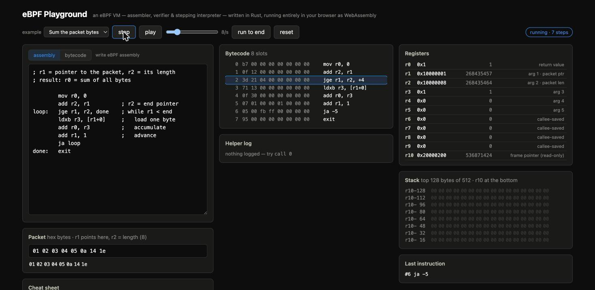

# eBPF Playground

Write, verify, and single-step eBPF programs **entirely in the browser**. The
whole toolchain — assembler, a teaching-oriented mini-verifier, disassembler,
and a stepping interpreter for the eBPF ISA — is one Rust crate compiled to
WebAssembly. No server, no Linux, nothing leaves the tab. SvelteKit renders
the visualizer.



```
┌──────────────────────────── Browser tab ────────────────────────────┐
│  ebpf-vm (Rust → WASM)                    SvelteKit                 │
│  · assembler (labels, 2-pass)         ◄── editor + examples         │
│  · verifier-lite (r10 writes, jump    ──► diagnostics in listing    │
│    bounds, div/0, unknown helpers…)                                 │
│  · disassembler                       ──► bytecode listing          │
│  · stepping interpreter               ──► registers · stack dump    │
│    r0–r10, 512B stack, packet memory      current insn · helper log │
└─────────────────────────────────────────────────────────────────────┘
```

## Try

live at https://rust-ebpf-playground.vercel.app/ 

## Run

```sh
cd web
pnpm i
pnpm dev
```

Client-only — no backend, no Linux, runs natively on macOS. `pnpm build`
emits a static SPA you can serve from anywhere.

## Two input modes

The editor toggles between **assembly** and **bytecode**. In bytecode mode you
paste raw eBPF (hex, e.g. the output of `bpftool prog dump xlated … opcodes`)
and the playground disassembles, verifies and single-steps *real compiled
programs* — switch to bytecode with a program loaded and it seeds the box with
that program's machine code.

The WASM package is checked-in-adjacent; rebuild it after touching `vm/`:

```sh
wasm-pack build vm --target web --release --out-dir ../web/src/lib/ebpf-vm --no-pack
cd vm && cargo test        # interpreter/assembler tests run natively
```

## The machine

- **Registers** r0–r10 (r10 = read-only frame pointer), 64-bit.
- **Memory**: the "packet" (program input, editable hex) mapped at
  `0x10000000` with `r1` = pointer / `r2` = length, and a 512-byte stack
  below `r10` at `0x20000200`. All accesses are bounds-checked; the error
  messages tell you which region you missed.
- **ISA**: full 64/32-bit ALU, `lddw`, all load/store widths, all
  conditional jumps (signed, unsigned, `jset`), `call`, `exit`. Div/mod by
  zero follow the modern ISA spec (0 / unchanged).
- **Helpers**: `call 0` = log_u64(r1), `call 1` = log_bytes(r1, r2) — like
  real helpers they clobber r1–r5 and return in r0.
- **Budget**: 100k instructions, then the VM stops you (the real verifier
  wouldn't even let you load a possibly-unbounded loop).

## Assembly dialect

```asm
; comments with ; # or //
        mov r0, 0
        add r2, r1
loop:   jge r1, r2, done     ; labels or +N/-N slot offsets
        ldxb r3, [r1+0]
        add r0, r3
        add r1, 1
        ja loop
done:   exit
```

Mnemonics follow the kernel documentation names (`mov/add/…`, `32` suffix
for the 32-bit ALU class, `ldx`/`stx`/`st` with `b/h/w/dw` widths, `lddw`
for 64-bit immediates).

## Slides

A self-contained overview deck lives in [`docs/index.html`](docs/index.html) — open it in any browser (arrow keys / space to navigate).
